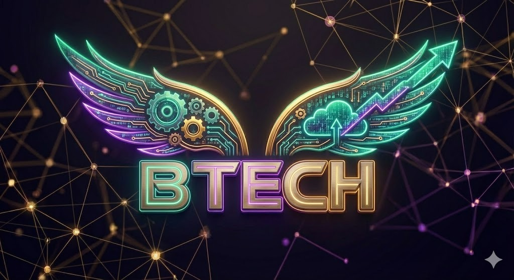

  

  
  
  

<h1 align="center">
  
</h1>

  
  
  

 

### 👨‍💻 About Me

> I am a dedicated **Software Developer** specializing in the **.NET ecosystem**. My passion lies in building scalable, high-performance backend systems and architecting clean, maintainable solutions. I actively leverage modern technologies like **Microservices**, **Docker**, and **Cloud-native patterns** to solve complex business problems.

 

### 🛠 Tech Stack & System Design

  <h2>⚡ T E C H &nbsp; A R S E N A L</h2>
  
  

    
  

   

  

 

### 🚀 Featured Projects

| Project | Role | Architecture & Tech |
| :--- | :--- | :--- |
| **DCSE** | *Backend Lead* | **ASP.NET Core API**, **Microservices**, **CQRS**.   Integrated **RabbitMQ** for async processing and **Redis** for distributed caching. Implemented **JWT** security and high-throughput endpoints. |
| **OhBau** | *Backend Developer* | **RESTful API**, **SQL Server**.   Optimized database performance for high-traffic mobile application. Reduced latency via aggressive caching strategies. |

 

### 📊 GitHub Analytics

  
  

  

 

  

 

  

